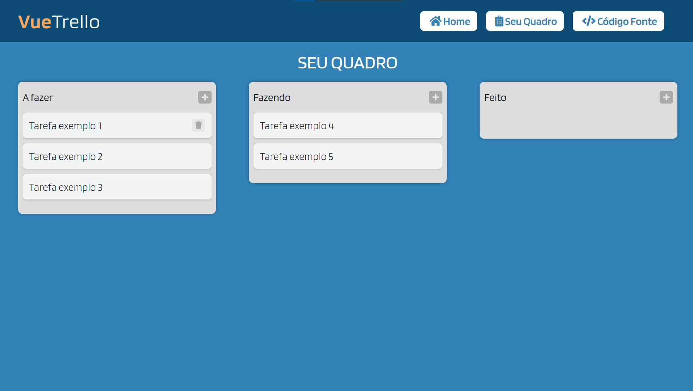

<h1 align="center">
  :clipboard: Vue Trello Clone :clipboard:
</h1>

<h4 align="center">
  A Web Application that users can create and manage their tasks, designed to be similar to the famous <a href="https://trello.com">Trello</a> application
</h4>

<p align="center">
  
  
</p>

<p align="center">
  <a href="#technologies">Used Technologies</a>&nbsp;&nbsp;&nbsp;|&nbsp;&nbsp;&nbsp;
  <a href="#objective">The project's objective</a>&nbsp;&nbsp;&nbsp;|&nbsp;&nbsp;&nbsp;
  <a href="#final-result">Final Result</a>&nbsp;&nbsp;&nbsp;|&nbsp;&nbsp;&nbsp;
  <a href="#how-to-use">How to Run</a>
</p>

<p align="center">
   <br>
  <a href="https://vue-trello-clone20.netlify.app/" target="_blank">
    
  </a>
</p>

<h2 id="techonologies" name="technologies">
  :rocket: Used Technologies
</h2>

- [Vue.js](https://br.vuejs.org) to build all the app in general
- [Sweet Alert](https://sweetalert.js.org/) to give the user friendlier alerts
- [Vue Smooth Dnd](https://kutlugsahin.github.io/vue-smooth-dnd/#/cards) to build the drag and drop feature
- [Sass](https://sass-lang.com/) to style the app


<h2 id="objective" name="objective">
  :dart: The project's objective
</h2>

The aim of this project was practicing Vue.js and also learning how drag and drop works and how to do it with Vue.js, I really enjoyed developing it and liked the final result!

<h2 id="final-result" name="final-result">
  :clipboard: Final Result
</h2>

### [You can check the app running clicking here](https://vue-trello-clone20.netlify.app/)

<h2 id="how-to-use" name="how-to-use">
  :information_source: How to Run
</h2>

Follow the steps below to run the application on your computed, first of all, you'll need to have these tools installed on your computer: Git, Node.js, Yarn and the Vue-CLI<br>
If you have all of these tools installed on your computer, just follow the steps below:

```bash
# Clone the repository in some directory of your computer
$ git clone https://github.com/TiagoDiass/vue-trello-clone.git

# Enter in the repository
$ cd vue-trello-clone

# Install the dependencies
$ yarn install

# Start the app
$ yarn start
```

After following these steps, the terminal will show you in which port it's running, it's on the port 8080 usually, so, you'll just need to enter in your browser and
type `localhost:8080`, then you'll see the app running. When you want to stop it, go to the terminal that you used to start the app, and type <kbd>CTRL</kbd>+<kbd>C</kbd>,
this way you'll stop the app

---

Hope you enjoyed this project :smiley:<br>
:wave: [Get in touch!](https://www.linkedin.com/in/tiagodiass)

### Author: [Tiago Dias](https://tiagodiass.github.io)
